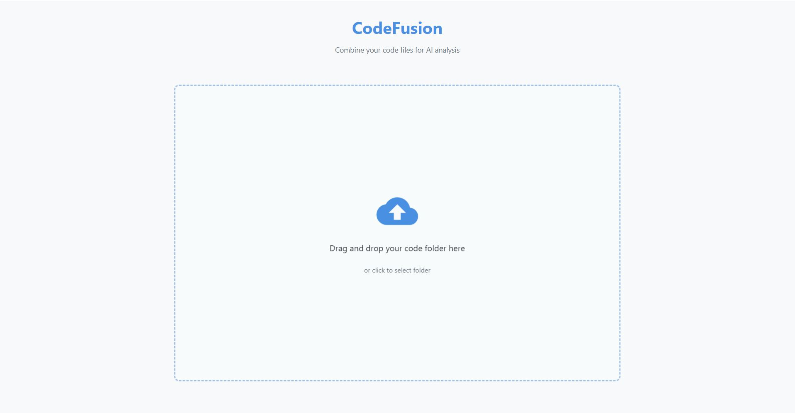
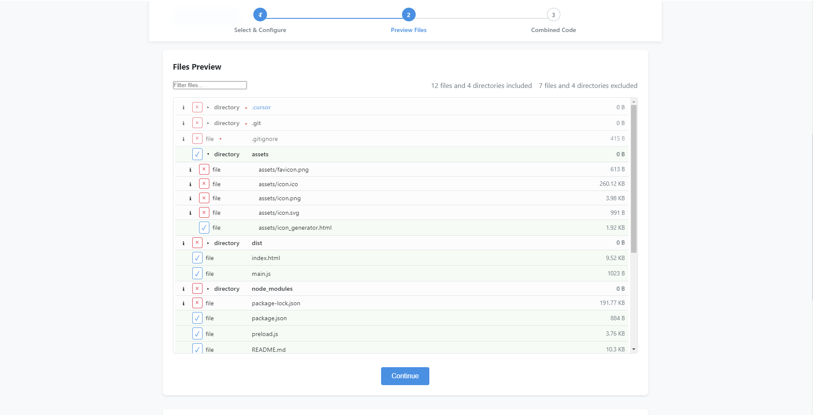
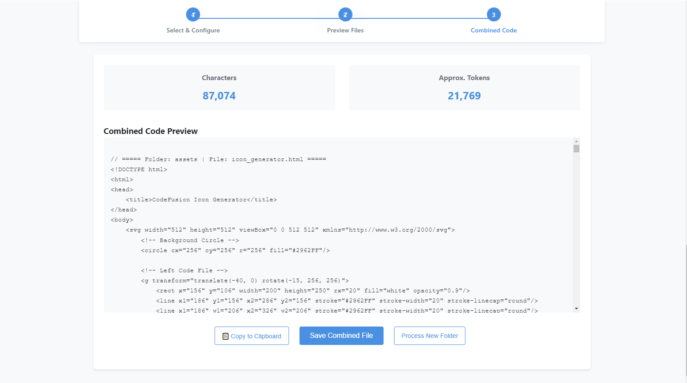

**CodeFusion**  

An app that merges your codebase into one text file so you can copy and paste it into another AI (e.g., one with a larger context window) for analysis.
   

---

## 1. Overview

**Purpose:**  
Create a desktop app that lets you drag-and-drop a codebase folder onto a window. The app recursively traverses the folder, reads supported code files, and combines them into one annotated text file for AI analysis. Annotations include each file's folder and name. The app features:

- **Extensive File Support:**  
  Supports a wide range of file types including:
  - JavaScript/TypeScript: `.js`, `.jsx`, `.ts`, `.tsx`, `.mjs`, `.cjs`
  - Web Development: `.html`, `.htm`, `.css`, `.scss`, `.sass`, `.less`, `.vue`, `.svelte`
  - Documentation/Config: `.md`, `.mdx`, `.txt`, `.yaml`, `.yml`, `.toml`, `.ini`, `.env.example`, `.json`, `.jsonc`, `.json5`
  - Python: `.py`, `.pyi`, `.pyw`, `.ipynb`
  - Other Languages: `.java`, `.kt`, `.scala`, `.c`, `.cpp`, `.h`, `.hpp`, `.cs`, `.go`, `.rb`, `.php`, `.rs`, `.swift`, `.sh`, `.bash`, `.zsh`, `.fish`, `.pl`, `.pm`
  - Config/Build: `.xml`, `.gradle`, `.properties`, `.dockerfile`, `.containerfile`, `.rules`

- **Smart File Omission:**  
  - Automatically excludes common non-essential directories (`.git`, `node_modules`, etc.)
  - Respects `.gitignore` patterns if present
  - Excludes media files (images, audio, video)
  - Provides checkboxes for common ignore patterns
  - Supports custom regex patterns for fine-grained control
  
- **Interactive File Preview:**  
  - Tree view of all files with inclusion/exclusion status
  - File size information
  - Collapsible directory structure
  - Search/filter functionality
  - Individual file toggles
  
- **Results and Statistics:**  
  - Character count
  - Approximate token count
  - Copy to clipboard functionality
  - Save to file option
  
- **Modern UI/UX:**
  - Drag-and-drop interface
  - Loading indicators
  - Clear feedback on file processing
  - Easy folder switching
  - Responsive design

---

## 2. Screenshots

To add screenshots:
1. Create a `screenshots` folder in your repository
2. Add your screenshots to the folder
3. Reference them in the README like this:

```markdown



```

*Note: Replace these placeholder images with your actual screenshots.*

---

## 3. Installation

### Prerequisites
- [Node.js](https://nodejs.org/) (v14 or higher)
- [npm](https://www.npmjs.com/) (usually comes with Node.js)
- [Git](https://git-scm.com/) (for cloning the repository)

### Steps to Install and Run

1. **Clone the Repository**
   ```powershell
   git clone https://github.com/YOUR_USERNAME/codefusion.git
   cd codefusion
   ```

2. **Install Dependencies**
   ```powershell
   npm install
   ```

3. **Run in Development Mode**
   ```powershell
   npm start
   ```

4. **Build for Production** (Optional)
   ```powershell
   npm run build
   ```
   This will create an installer in the `dist` folder.

### Troubleshooting
- If you encounter any issues with native dependencies, make sure you have the following installed:
  - Windows Build Tools: Run `npm install --global windows-build-tools` in an elevated (Administrator) PowerShell
  - Python 2.7 or 3.x (required for some node modules)
- If you get permission errors, make sure you're running the commands with appropriate privileges

---

## 4. Implementation Status

### 4.1 Core Features ✅
- [x] Drag-and-drop folder selection ✅
- [x] File system traversal ✅
- [x] Smart file filtering ✅
- [x] File content combination ✅
- [x] Statistics calculation ✅
- [x] Save functionality ✅

### 4.2 UI Features ✅
- [x] Interactive file preview ✅
- [x] Folder selection dialog ✅
- [x] Loading overlay ✅
- [x] File tree view ✅
- [x] Omission controls ✅
- [x] Results display ✅

### 4.3 Advanced Features ✅
- [x] `.gitignore` support ✅
- [x] Custom regex filters ✅
- [x] Individual file overrides ✅
- [x] Directory collapsing ✅
- [x] File search/filtering ✅
- [x] Copy to clipboard ✅

---

## 5. High-Level Architecture

### 5.1 Main Process
- **Entry Point:** `main.js`  
- **Responsibilities:**  
  - Create and manage the main application window.  
  - Handle file system operations (reading directories, files, applying omission patterns).  
  - Use Node.js APIs (`fs`, `path`) to process files.  
  - Expose IPC channels (using `ipcMain`) to receive folder paths and omission settings from the renderer and to send back the combined text and statistics.  
  - Handle file-save dialogs for exporting the combined file.

### 5.2 Renderer Process
- **Entry Point:** `index.html`  
- **Responsibilities:**  
  - Render the drag-and-drop interface and controls for omission settings.  
  - Allow the user to view an interactive preview of files that will be included or omitted (with the option to adjust filters or regular expressions).  
  - Display progress, statistics (character count and approximate token count), and final results.  
  - Trigger processing via IPC calls to the main process.

### 5.3 IPC Communication
- **Channel Examples:**  
  - `process-folder`: Renderer sends the dropped folder path along with omission settings (an array of regular expressions) to the main process.  
  - `processing-complete`: Main process returns the combined text and statistics (total characters, token approximation).  
  - `save-file`: Initiates a save dialog to write the output file.

---

## 6. Detailed Technical Specification

### 6.1 File Handling and Recursion

- **Recursive Traversal:**  
  Use a recursive function in the main process to traverse the dropped folder. For each file:
  - Check if it matches the supported file extensions (`js`, `json`, `md`, `ts`, `html`, `css`, `rules`, `py`).
  - Apply default and user-specified omission rules.  
    - **Defaults include:**  
      - Patterns from a `.gitignore` file (if present in the root).  
      - Folders named `.git`, `node_modules`.  
      - Any file/folder starting with a period (e.g., `.next`, `.swc`).
  - If a file is not omitted, read its content and prepend an annotation header such as:
    ```plaintext
    // ===== Folder: /path/to/folder | File: example.js =====
    ```

- **Interactive Preview:**  
  Before final processing:
  - Build a list of all files encountered along with a flag indicating whether each file will be included or omitted.
  - Send this list to the renderer so the user can review and adjust the omission patterns if needed.
  - Allow the user to "toggle" or modify the omission rules via text input or checkboxes (for common patterns).

### 6.2 Combining Files and Generating Statistics
- **Combining Logic:**  
  As files are read, append the annotated content to a single string (or stream it if needed for larger projects).
  
- **Statistics Calculation:**  
  - **Character Count:**  
    ```js
    const totalCharacters = combinedText.length;
    ```
  - **Approximate Token Count:**  
    ```js
    const approxTokens = Math.ceil(totalCharacters / 4);
    ```
  (This approximation assumes an average of 4 characters per token, which is acceptable for your needs.)

### 6.3 User Interface

#### 6.3.1 Main Window Layout
- **Drag-and-Drop Area:**  
  A prominent area where users can drop their folder. Visual cues (e.g., "Drop your code folder here") help indicate the action.
  
- **Omission Controls:**  
  - A text input area to enter additional regular expressions or file extensions to omit.
  - Checkboxes for common omissions (e.g., "Ignore .git", "Ignore node_modules", "Ignore files/folders starting with a period").
  - A preview pane listing files with an indicator for whether they will be processed or skipped.
  
- **Progress Indicator:**  
  A progress bar or spinner during file processing.
  
- **Results Panel:**  
  After processing, display:
  - Total characters and approximate token count.
  - A large text area containing the combined annotated code.
  - A "Save File" button to export the results via a file dialog.

#### 6.3.2 Example UI Flow
1. **Landing Screen:**  
   The main window invites you to drag and drop your code folder.
2. **Preview Screen:**  
   Once the folder is dropped, the app shows a list of files marked as "included" or "omitted." You can adjust omission rules here.
3. **Processing Screen:**  
   Upon confirmation, the app processes the files while displaying progress.
4. **Results Screen:**  
   The app shows the combined text along with character and token counts, and provides an option to save the file.

### 6.4 Packaging for Windows
- **Tool:**  
  Use a tool like **electron-builder** to package the app as a Windows installer.
- **Configuration:**  
  Create a configuration file (`electron-builder.json` or package.json entries) specifying Windows targets, icon assets, and installation options.

---

## 7. Code Structure Overview

```
/my-code-combiner-app
├── package.json            // Dependencies (electron, electron-builder, etc.) and scripts
├── main.js                 // Main process: creates the window, handles IPC, and processes files
├── preload.js              // (Optional) Securely expose required Node APIs to the renderer
├── renderer.js             // Handles UI logic, drag-and-drop, preview, and interactions
├── index.html              // Main HTML file for the UI
├── styles.css              // Styling for the UI
└── ignoreDefaults.js       // (Optional) Contains default ignore patterns and .gitignore processing logic
```

---

## 8. Additional Considerations

- **Performance:**  
  Given a couple of megabytes of code (after omitting `node_modules` and similar folders), synchronous file reads should suffice, though you could refactor to asynchronous reads if needed.
  
- **AI Analysis Metadata:**  
  Currently, the app includes annotations (folder and file names) for context. If needed later, you could add timestamps or file sizes, but this should be sufficient for AI models to understand file context.

- **Installer Packaging:**  
  Use **electron-builder** with a configuration tailored to Windows, ensuring that the app can be installed easily on Windows systems.

